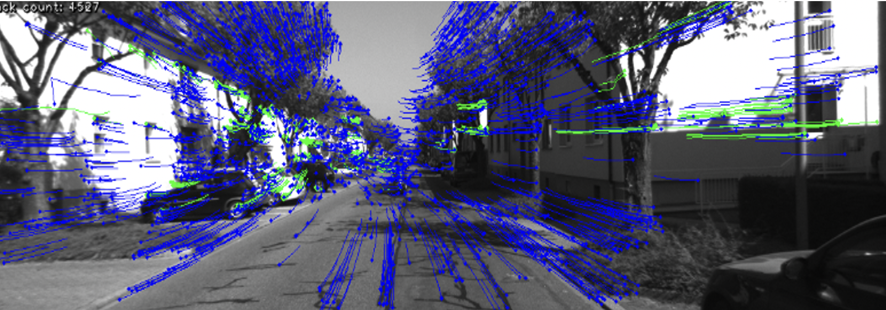
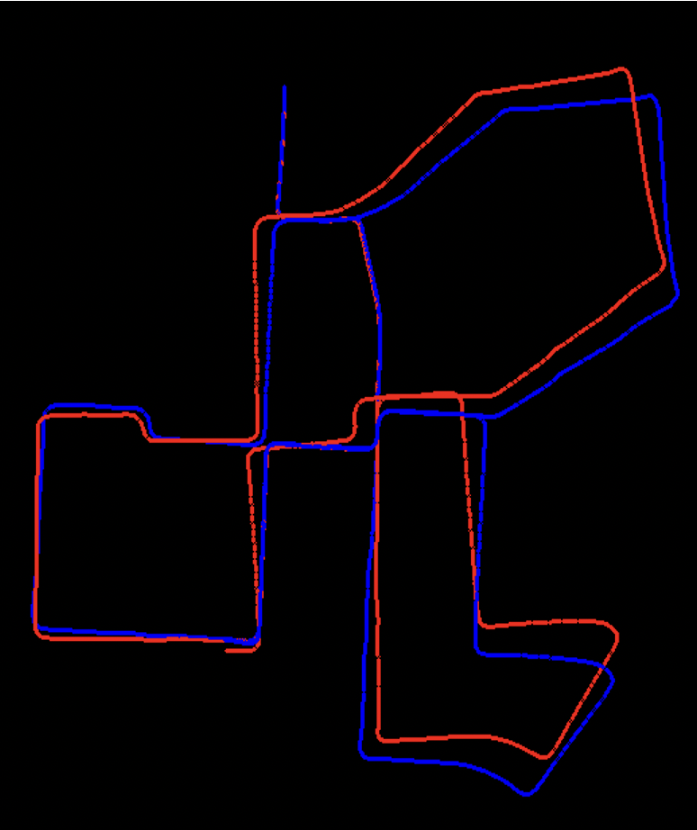

# Prerequisites:

1. Download the Visual Odometry dataset from Kitti Vision Benchmark Suite
  http://www.cvlibs.net/download.php?file=data_odometry_gray.zip
2. Download the Visual Odometry poses data
http://www.cvlibs.net/download.php?file=data_odometry_poses.zip
3. Download the repository and extract it.
4. Download and install opencv (with opencv_contrib) with python 3.5+
5. Extract the dataset and poses data in the repository folder

# Testing the code 
Run test.py
# Results:
 \
\
Blue: Ground Truth \
Red: Experimental Results \

